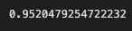
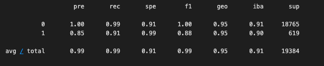
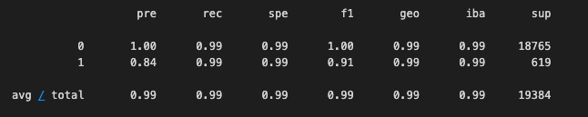

# *Columbia Fintech Challenge 12*
## *Credit Risk Classification (Supervised Machine Learning Model)*

## Overview of the Analysis

* The purpose of this analysis is to build a model that can identify the creditworthiness of borrowers using by looking at the historical lending activity from a peer-to-peer lending services company. 
* Dependant variable (y value) in this analysis was the "loan status" indicating if a loan is healthy or at risk. 
* Independent Variables (x values) were loan size, interest rate, borrower income, debt to income ratio, number of accounts and derogatory marks.
* In this analysis, we first split our data to traning and test sets. Then, define our dependent and independent variables. Next, we create logistic regression model and fit our original data to this model. Trained model is used to make predictions. Lastly, we evaluate the model`s performance. 
* Two diffeent Logistic Regression models were created by using the original data set and randomy over resampled data set (to get rid of the imbalances). In the end, their results -which was gathered with scikit-learn library- were compared.

## Results

* Logistic Regression Model with Original Data
 

* Logistic Regression Model with Randomly Oversampled Data

## Summary

Analysis show that collected data can be effectively used to train and test the Machine Learning Classification Model. For better preditions solving the imbalance sampling issue is needed.

Randomly oversampling the data helps us to get higher balanced accuracy and recall scores. With higher recall value, model can predict risky loans more accurately.

With incorrect predictions we have two issues:

* False positives (where users are flagged as risky, but are actually healthy)
* False negatives (where users are not flagged as risky but are actually risky)

Both cases have its costs. It is important to predict both 1`s and 0`s. Therefore, both models should have good accuracy.

---

## **Contributors**

### **Author**

Tommy Magee
[LinkedIn](https://www.linkedin.com/in/thomas-magee-2009a72a/)

### **BootCamp lead instructor**

Vinicio De Sola

### **BootCamp teaching assistants**

Eli Holden

---

## License

MIT License

Copyright (c) [2022] [Thomas 'Tommy' Magee]

Permission is hereby granted, free of charge, to any person obtaining a copy
of this software and associated documentation files (the "Software"), to deal
in the Software without restriction, including without limitation the rights
to use, copy, modify, merge, publish, distribute, sublicense, and/or sell
copies of the Software, and to permit persons to whom the Software is
furnished to do so, subject to the following conditions:

The above copyright notice and this permission notice shall be included in all
copies or substantial portions of the Software.

THE SOFTWARE IS PROVIDED "AS IS", WITHOUT WARRANTY OF ANY KIND, EXPRESS OR
IMPLIED, INCLUDING BUT NOT LIMITED TO THE WARRANTIES OF MERCHANTABILITY,
FITNESS FOR A PARTICULAR PURPOSE AND NONINFRINGEMENT. IN NO EVENT SHALL THE
AUTHORS OR COPYRIGHT HOLDERS BE LIABLE FOR ANY CLAIM, DAMAGES OR OTHER
LIABILITY, WHETHER IN AN ACTION OF CONTRACT, TORT OR OTHERWISE, ARISING FROM,
OUT OF OR IN CONNECTION WITH THE SOFTWARE OR THE USE OR OTHER DEALINGS IN THE
SOFTWARE.

